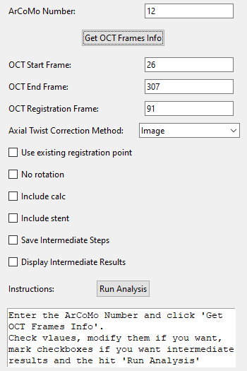

# ArCoMo_DigitalModel_Workflow

## About
Artificial Coronary Model (ArCoMo) Digital Model Workflow was created for the 3D reconstruction of coronary arteries 
by the registration of optical coherence tomography (OCT) and computed coronary tomography angiography.

## Example
After `git clone` and installing `requirements.txt` run the following command

`python workflow_stent_calc\workflow_stent_calc_main.py`

This will open the navigator to generate your model as shown in the following figure. Enter the number 12 to follow the 
example.

The navigator allows for different parameters and features to be included. At the bottom it displays instructions of the
current step.
