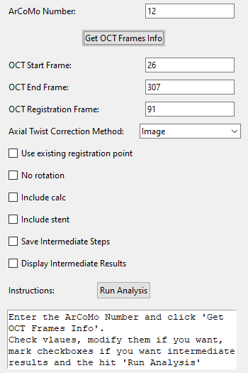

# ArCoMo DigitalModel Workflow

## About
Artificial Coronary Model (ArCoMo) Digital Model Workflow was created for the 3D reconstruction of coronary arteries 
by the registration of optical coherence tomography (OCT) and computed coronary tomography angiography. Additional 
features to segment and model calcifications or stents are included.

## Setup
The preferred python version to facilitate this workflow is 3.10. Use `git clone` and install `requirements.txt`. 

## Example
To start the workflow run the following command:

`python workflow_stent_calc\workflow_stent_calc_main.py`

This will open the navigator to generate your model as shown in the following figure. Enter the number 12 to follow the 
example.

The navigator allows for different parameters and features to be included. At the bottom it displays instructions of the
current step.

| Selection                       | Effect                                                             |
|:--------------------------------|:-------------------------------------------------------------------|
| Use existing registration point | If the OCT registration point of a previous workflow shall be used |
| No rotation                     | No rotational correction of the OCT pullback during registration   |
| Include calc                    | Segment and register calcifications and save in outputs            |
| Include stent                   | Register stent points and save in outputs                          |
| Save intermediate steps         | -                                                                  |
| Display intermediate results    | -                                                                  |